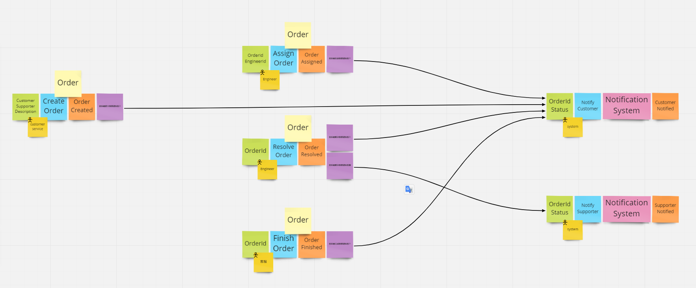

<!-- PROJECT LOGO -->
<div id="top"></div>
<div align="center">
  <div align="center">
  </div>
  <h3 align="center">Cypress-test-temp</h3>
</div>

## About This Project

This project is based on the design of my previous job, It is a example for reference

## Create Test Case

* I often use the domain event in DDD to design the early test case first, and then cover aggregate edge cases.
Because the test case may be related to the back-end of a decentralized architecture, so I use aggregate as a splitting point

* But my ```support``` folder is split by view


```shell
Project
├─ ...
├─ cypress
│  ├─ ...
│  ├─ integration
│  │  ├─ aggregate1
│  │  ├─ aggregate2
│  │  ├─ aggregate-*
│  │  └─ ...
│  ├─ support
│  │  ├─ view1.js
│  │  ├─ view2.js
│  │  ├─ view-*.js
│  │  ├─ ...
│  │  ├─ command.js
│  │  └─ index.js
│  └─ ...
```

## Example



```shell
Project
├─ ...
├─ cypress
│  ├─ ...
│  ├─ integration
│  │  ├─ Order
│  │  │  ├─ CreateOrder.spec.js
│  │  │  ├─ ResolveOrder.spec.js
│  │  │  └─ ...
│  │  └─ ...
│  ├─ support
│  │  ├─ OrderCreatePage.js
│  │  ├─ OrderDetailPage.js
│  │  ├─ ...
│  │  ├─ command.js
│  │  └─ index.js
│  └─ ...
```

## Useful Links

### Command Link

- [Cypress command](https://docs.cypress.io/api/table-of-contents)
- [Cypress RWA](https://github.com/cypress-io/cypress-realworld-app)

---

## Usage

- Install dependencies

```shell
yarn
```

- Open the Cypress app on your machine

```shell
yarn test
```

- And then you can run the test by click fileName

---

## Commit Message Guidelines

- Please refer to [Conventional Commits](https://www.conventionalcommits.org/en/v1.0.0/).

### Commit Message Format
Use type below (I delete some useless type) :

- `feat` : New feature
- `fix` : Bug fix
- `refactor` : Refactor test case
- `revert` : Undo edit
- `docs` : Documentation/notes
- `chore`
- `ci` : Continuous integration

<p align="right">(<a href="#top">back to top</a>)</p>

---

## Project structure

```shell
Project
├─ .asset                                   #  docs asset
├─ .husky                                   #  husky config folder (lint check before commit)
├─ .vscode                                  #  vscode config folder (extension convenience)
├─ cypress
│  ├─ fixtures                              #  attachments used for testing
│  ├─ integration
│  │  └─ *.spec.js                          #  test case
│  ├─ plugins                               #  cypress plugin (like browser permission)
│  └─ support                               #  support func for your test case
│     ├─ *-Page.js                          #  test support base on page view
│     ├─ index.js
│     └─ commands.js                        #  common commands
└─ ...
```

<p align="right">(<a href="#top">back to top</a>)</p>
